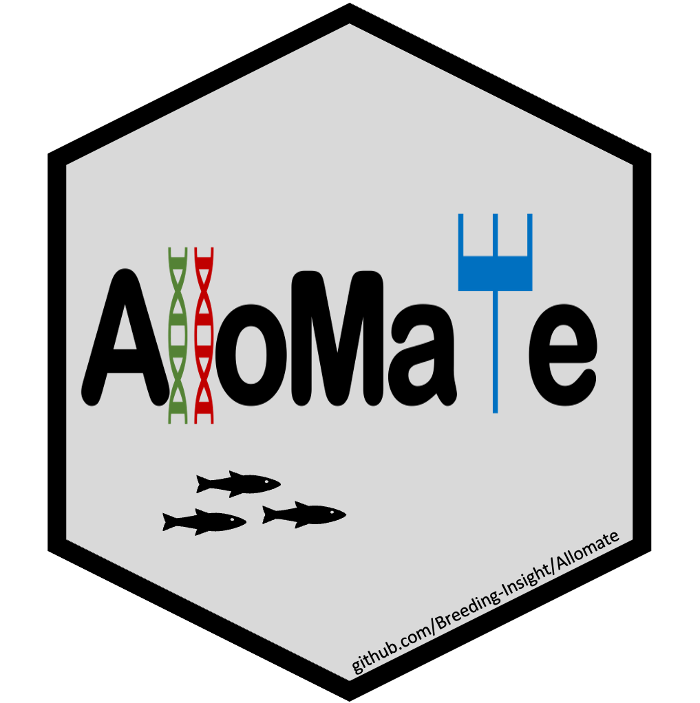

# AlloMate

AlloMate is a shiny app that simplifies mate allocation decisions for breeders.
  
## Overview
This shiny app allows breeders to combine multiple traits in a selection index and assign a relative weight to each trait. AlloMate also allows to simplify mate allocation by filtering out possible crosses with negative ebvs and by using a kinship threshold between parents set by the user.
Current version calculates kinship through pedigree information only, we are working on supporting genotypic information using an Optimal Contribution Selection (OCS) framework in the near future.
## Usage
### To run the app:  
install.packages("shiny") #If not already installed   
library(shiny)  
runGitHub(repo = "Breeding-Insight/AlloMate", subdir = "app")

### Input files
##### Pedigree
3 column tab separated file with with headers id, sire and dam in any order.

##### Selecton Candidates
2 column tab separated file with candidate ids in "id" column and M or F in "sex" column.

##### EBVs
One tab-separated file per trait, 2 colummns "ID and EBV"

### Output file
Excel file with two tabs. 
First tab shows a table with all possible male and female combinations regardless of any filters applied. 
Second tab shows a matrix with females in rows and males in columns, crosses with kinship coefficients larger than theshold or negative EBVs will be blank.

### Caution
Before uploading, ensure that **EBVs are pre-processed**:

- **Centered and scaled**, if appropriate for your analysis  
- **Transformed to a positive scale**, so that higher values represent better individuals  

Proper preprocessing ensures that the selection index and filtering steps in the app function as intended.
